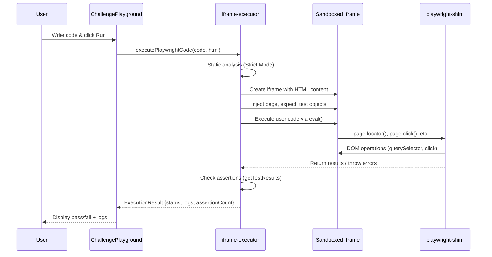

# Challenge Executor Architecture

This document explains how the challenge execution system works - from user code input to validation.

## Overview

The challenge executor runs user-submitted Playwright-style code in a **sandboxed browser iframe**. It provides a shim layer that mimics Playwright's API using DOM operations.

## Flow Diagram



## Component Responsibilities

### `ChallengePlayground.tsx`

- UI component with code editor and preview
- Calls executor and displays results
- Handles submission to server on success

### `iframe-executor.ts`

- Creates sandboxed iframe with HTML content
- Injects polyfills (fetch mocking, dialog handling)
- Executes user code with timeout protection
- Collects logs and assertion results

### `playwright-shim.ts` (MockedPlaywrightPage)

- Implements Playwright's Page API using DOM
- Provides: `locator()`, `click()`, `fill()`, `waitForSelector()`
- Auto-wait behavior for element visibility
- Visual highlighting for debugging

### `selector-validator.ts`

- Validates CSS and XPath selectors
- Used for selector-only challenges

## Execution Context

```text
┌─────────────────────────────────────────────┐
│  Main Window (App)                          │
│  ┌───────────────────────────────────────┐  │
│  │  Sandboxed Iframe                     │  │
│  │  ┌─────────────────────────────────┐  │  │
│  │  │  User HTML Content              │  │  │
│  │  │  + Injected Scripts             │  │  │
│  │  │  + MockedPlaywrightPage (page)  │  │  │
│  │  │  + expect() assertions          │  │  │
│  │  └─────────────────────────────────┘  │  │
│  └───────────────────────────────────────┘  │
└─────────────────────────────────────────────┘
```

## Key Design Decisions

| Decision               | Rationale                              |
| ---------------------- | -------------------------------------- |
| Client-side execution  | No server load, instant feedback       |
| Iframe sandbox         | Isolates user code from main app       |
| Playwright API shim    | Teaches real-world automation patterns |
| Synthetic events       | Works in browser (not CDP)             |
| State-based validation | Simple, reliable for educational use   |

## Limitations

1. **Untrusted Events**: Synthetic events have `isTrusted: false`
2. **No Network Spying**: Cannot verify actual fetch calls were made
3. **Simplified Visibility**: Basic `display:none` check, not full Playwright logic
4. **Gaming Possible**: Users can manipulate DOM directly to pass tests

## File Locations

```text
src/core/executor/
├── index.ts              # Barrel export
├── iframe-executor.ts    # Main execution engine
├── playwright-shim.ts    # Playwright API implementation
└── selector-validator.ts # CSS/XPath validation
```

## Related Documentation

- [TDD.md](./TDD.md) - Technical Design Document
- [app_flows.md](./app_flows.md) - Application user flows
- [solutions.md](./solutions.md) - Challenge solutions reference
