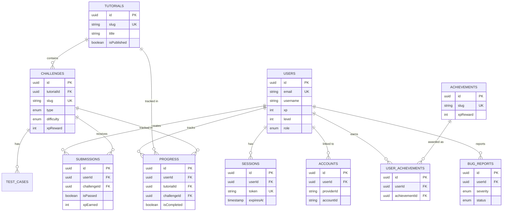

# Entity Relationship Diagram (ERD)

**Version:** 1.0  
**Date:** January 2, 2026

## Overview

This document describes the database schema for the TestingWithEkki platform. The application uses PostgreSQL as the relational database engine, managed via Drizzle ORM.

## Visual Diagram

## Enums

The application uses the following PostgreSQL enums:

| Enum Name | Values | Description |
|-----------|--------|-------------|
| `block_type` | `JAVASCRIPT`, `PLAYWRIGHT`, `CSS_SELECTOR`, `XPATH_SELECTOR` | Types of challenges available |
| `user_role` | `USER`, `ADMIN` | User permission levels |
| `difficulty` | `EASY`, `MEDIUM`, `HARD` | Challenge difficulty levels |
| `profile_visibility` | `PUBLIC`, `PRIVATE` | User privacy settings |
| `bug_severity` | `CRITICAL`, `HIGH`, `MEDIUM`, `LOW` | Impact level of reported bugs |
| `bug_report_status` | `NEW`, `IN_PROGRESS`, `RESOLVED`, `WONT_FIX`, `CLOSED` | Lifecycle status of a bug report |

## Tables Schema

### Authentication & Users

#### `users`

Core user profile data.

- **id** (`uuid`, PK): Unique identifier
- **email** (`text`, Unique): User's email address
- **emailVerified** (`boolean`): Whether email is verified (default: `false`)
- **name** (`text`): Display name
- **image** (`text`): Avatar URL
- **xp** (`integer`): Total experience points (default: `0`)
- **level** (`integer`): Current user level (default: `1`)
- **role** (`user_role`): User role (default: `USER`)
- **profileVisibility** (`profile_visibility`): Privacy setting (default: `PUBLIC`)
- **showOnLeaderboard** (`boolean`): Leaderboard opt-in (default: `true`)
- **Timestamps**: `createdAt`, `updatedAt`

#### `sessions`

Active user sessions managed by BetterAuth.

- **id** (`uuid`, PK): Session ID
- **userId** (`uuid`, FK -> `users.id`): Linked user
- **token** (`text`, Unique): Session token
- **expiresAt** (`timestamp`): Session expiration
- **ipAddress** (`text`): User IP
- **userAgent** (`text`): User browser agent
- **Timestamps**: `createdAt`, `updatedAt`

#### `accounts`

Linked OAuth accounts (Google, GitHub, etc.).

- **id** (`uuid`, PK): Account ID
- **userId** (`uuid`, FK -> `users.id`): Linked user
- **accountId** (`text`): Provider's unique user ID
- **providerId** (`text`): Auth provider name (e.g., "google")
- **accessToken**, **refreshToken**, **idToken**: OAuth tokens
- **password**: Hashed password (for email/password auth)
- **Timestamps**: `createdAt`, `updatedAt`

#### `verification`

Tokens for email verification and password resets.

- **id** (`uuid`, PK): Token ID
- **identifier** (`text`): Email or User ID
- **value** (`text`): Secret token value
- **expiresAt** (`timestamp`): Token expiration

### Content Management

#### `tutorials`

Learning modules and guides.

- **id** (`uuid`, PK): Tutorial ID
- **slug** (`text`, Unique): URL-friendly identifier
- **title** (`text`): Tutorial title
- **description** (`text`): Short summary
- **content** (`text`): Markdown body content
- **order** (`integer`): Sort order in lists
- **estimatedMinutes** (`integer`): Reading time
- **tags** (`text[]`): Categorization tags
- **isPublished** (`boolean`): Visibility flag
- **viewCount** (`integer`): Analytics counter
- **Timestamps**: `createdAt`, `updatedAt`

#### `challenges`

Interactive exercises for users.

- **id** (`uuid`, PK): Challenge ID
- **slug** (`text`, Unique): URL-friendly identifier
- **title** (`text`): Challenge name
- **description** (`text`): Problem statement
- **type** (`challenge_type`): Exercise category (JS, Playwright, Selectors)
- **difficulty** (`difficulty`): Difficulty rating
- **xpReward** (`integer`): XP awarded on completion
- **order** (`integer`): Sort order
- **instructions** (`text`): Detailed steps
- **htmlContent** (`text`): HTML snippet for selector challenges
- **starterCode** (`text`): Initial code in editor
- **tutorialId** (`uuid`, FK -> `tutorials.id`): Optional link to tutorial
- **category** (`text`): Broad category grouping
- **isPublished** (`boolean`): Visibility flag
- **completionCount** (`integer`): Success counter
- **Timestamps**: `createdAt`, `updatedAt`

#### `test_cases`

Validation criteria for challenges.

- **id** (`uuid`, PK): Test case ID
- **challengeId** (`uuid`, FK -> `challenges.id`): Parent challenge
- **description** (`text`): Test name/description
- **input** (`jsonb`): Input arguments/context
- **expectedOutput** (`jsonb`): Expected result
- **isHidden** (`boolean`): If true, details hidden from user until solved
- **order** (`integer`): Execution order

### User Progress

#### `submissions`

History of code attempts by users.

- **id** (`uuid`, PK): Submission ID
- **userId** (`uuid`, FK -> `users.id`): User who submitted
- **challengeId** (`uuid`, FK -> `challenges.id`): Challenge attempted
- **code** (`text`): Submitted solution code
- **isPassed** (`boolean`): Pass/Fail status
- **xpEarned** (`integer`): XP granted for this specific submission
- **executionTime** (`integer`): Runtime in ms
- **testsPassed**, **testsTotal**: Stats
- **errorMessage** (`text`): Runtime error details (if any)
- **createdAt**: Submission timestamp

#### `progress`

Tracks completion status for both tutorials and challenges.

- **id** (`uuid`, PK): Record ID
- **userId** (`uuid`, FK -> `users.id`): User
- **tutorialId** (`uuid`, FK -> `tutorials.id`, Nullable): Linked tutorial
- **challengeId** (`uuid`, FK -> `challenges.id`, Nullable): Linked challenge
- **isCompleted** (`boolean`): Completion flag
- **completedAt** (`timestamp`): Completion time
- **readingProgress** (`integer`): % read (for tutorials)
- **attempts** (`integer`): Try count (for challenges)
- **bestSubmissionId** (`uuid`, FK -> `submissions.id`): Link to best successful attempt

### Gamification

#### `achievements`

Badges and milestones definitions.

- **id** (`uuid`, PK): Achievement ID
- **slug** (`text`, Unique): Identifier
- **name** (`text`): Display name
- **description** (`text`): How to earn it
- **icon** (`text`): Emoji or icon URL
- **category** (`text`): Grouping
- **requirementType** (`text`): Logic trigger type
- **requirementValue** (`integer`): Threshold value
- **xpReward** (`integer`): Extra XP bonus
- **isSecret** (`boolean`): Hidden until unlocked

#### `user_achievements`

Unlock records for users.

- **id** (`uuid`, PK): Record ID
- **userId** (`uuid`, FK -> `users.id`): User
- **achievementId** (`uuid`, FK -> `achievements.id`): Earned badge
- **unlockedAt** (`timestamp`): Date earned
- **progress** (`integer`): Current progress towards next tier

### Maintenance

#### `bug_reports`

User-submitted issue reports.

- **id** (`uuid`, PK): Report ID
- **userId** (`uuid`, FK -> `users.id`, Nullable): Reporter
- **reporterEmail** (`text`): For anonymous reports
- **title** (`text`): Issue summary
- **severity** (`bug_severity`): Impact level
- **status** (`bug_report_status`): Triage status
- **stepsToReproduce**, **expectedBehavior**, **actualBehavior**: QA details
- **pageUrl**, **browserInfo**: Auto-captured context
- **adminNotes** (`text`): Internal comments
