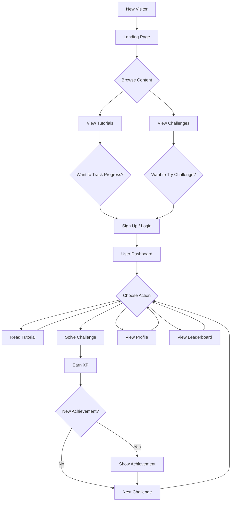
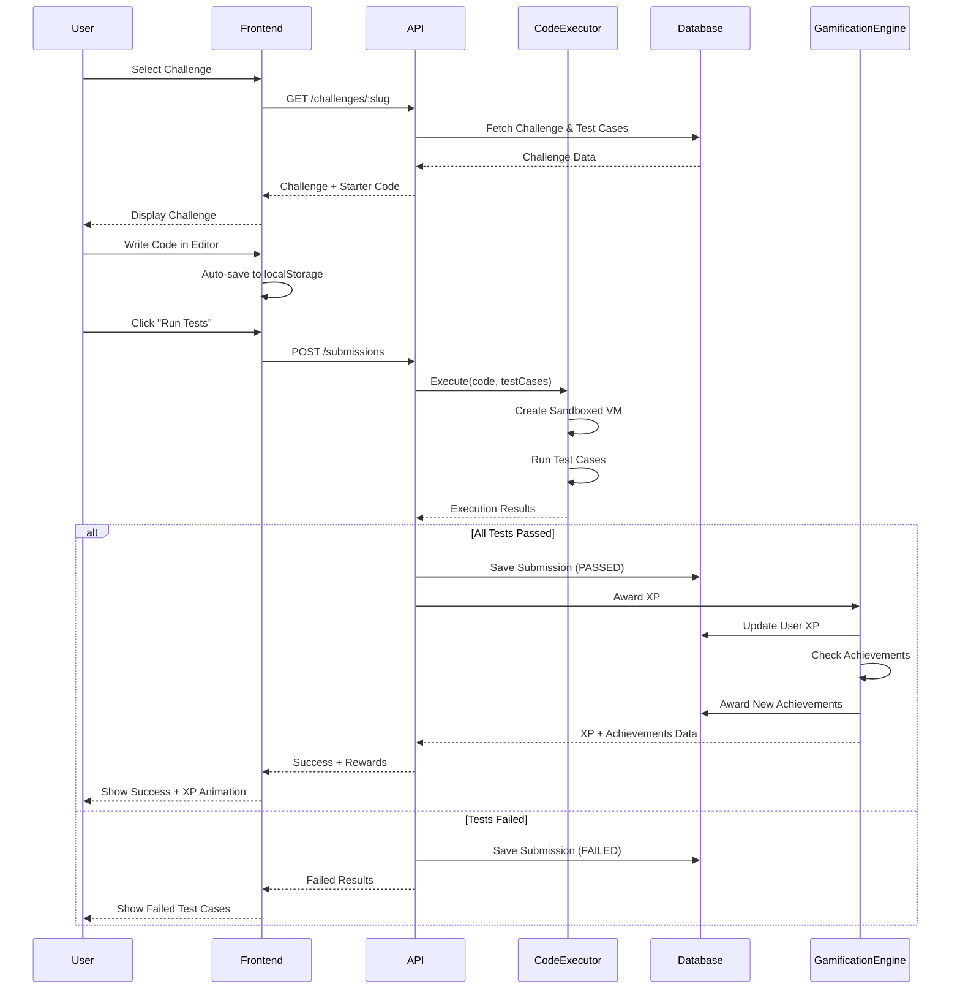
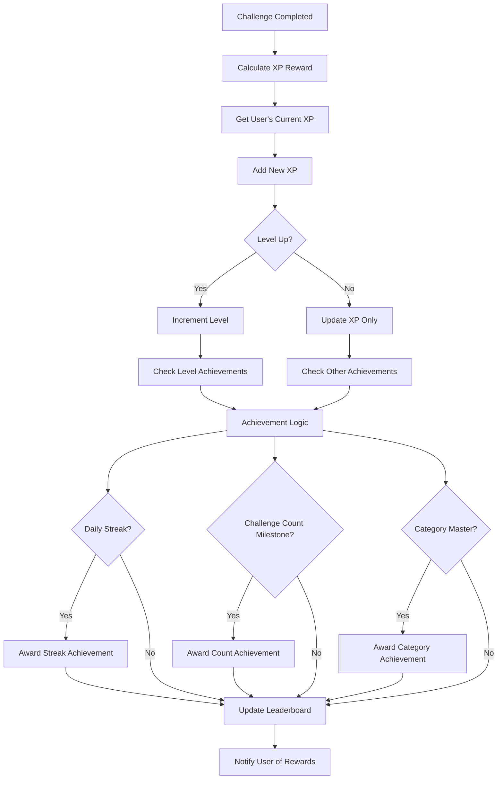
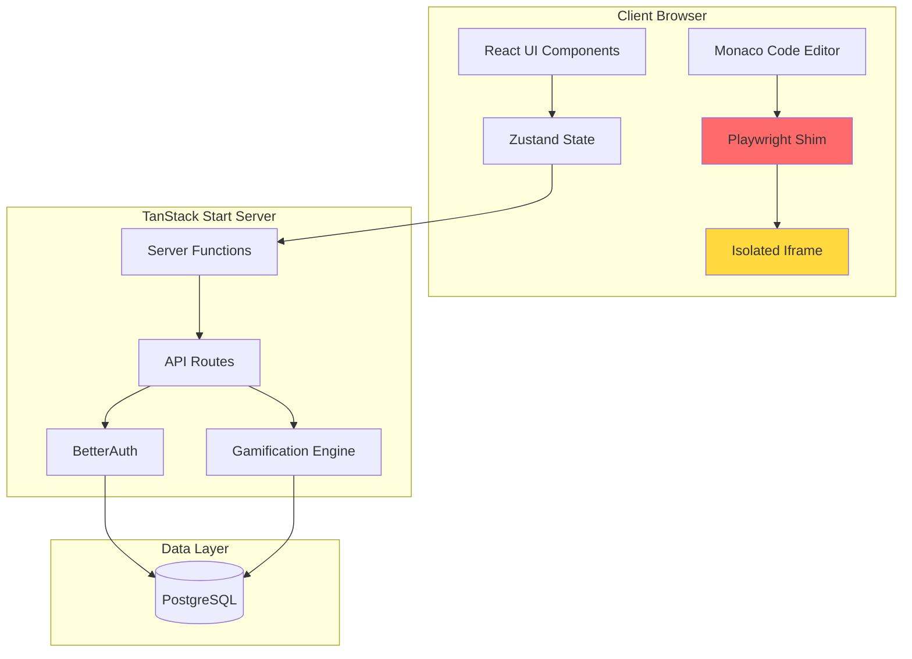
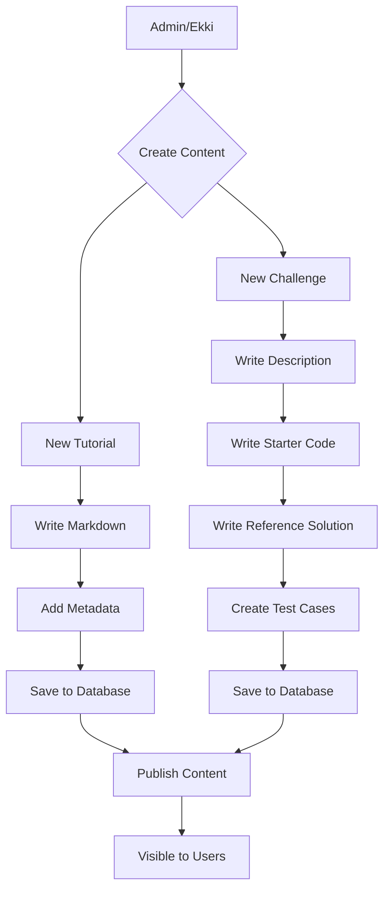
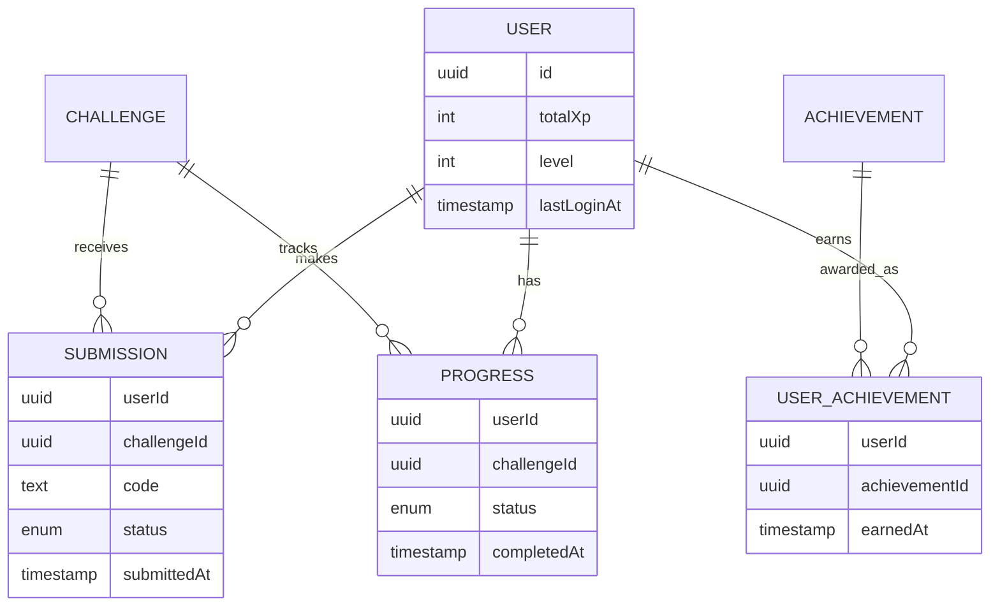
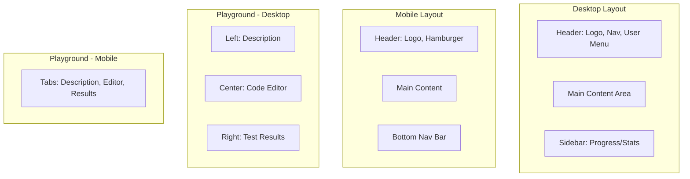
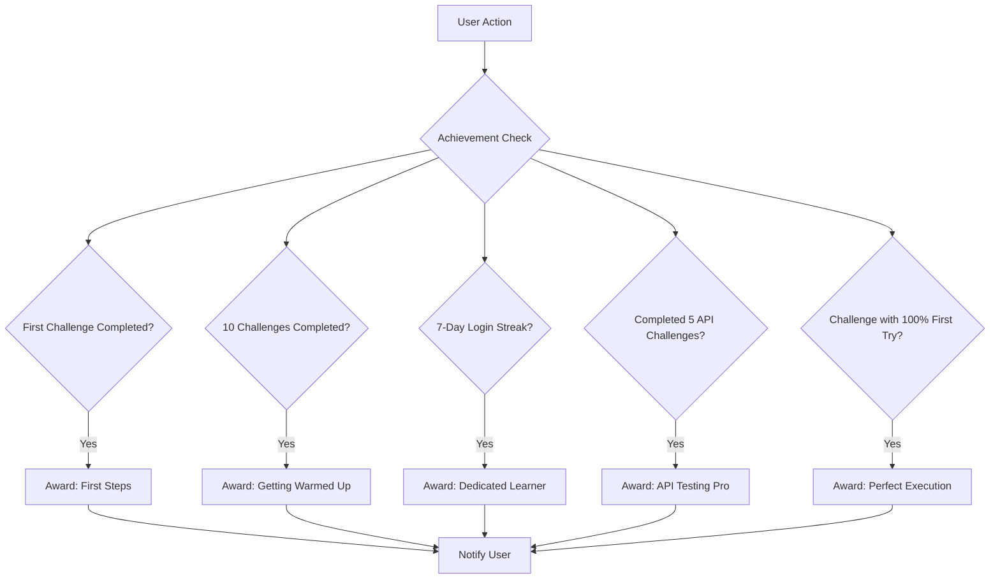

# TestingWithEkki - Application Flows

This document visualizes the key user flows and system interactions for the TestingWithEkki platform.

---

## 1. User Journey Overview

---

## 2. Challenge Solving Flow (Detailed)

---

## 3. Authentication Flow

```mermaid
graph TB
    subgraph "Registration Flow"
        RegStart[User Clicks Register] --> RegForm[Fill Registration Form]
        RegForm --> RegValidate{Client Validation}
        RegValidate -->|Invalid| RegError[Show Field Errors]
        RegError --> RegForm
        RegValidate -->|Valid| RegSubmit[POST /auth/register]
        RegSubmit --> RegServer{Server Validation}
        RegServer -->|Email Exists| RegFail[Registration Failed]
        RegServer -->|Success| RegHash[Hash Password]
        RegHash --> RegSave[Create User in DB]
        RegSave --> RegToken[Generate JWT Token]
        RegToken --> RegSuccess[Return User + Token]
        RegSuccess --> RegStore[Store Token in localStorage]
        RegStore --> RegRedirect[Redirect to Dashboard]
    end
    
    subgraph "Login Flow"
        LoginStart[User Clicks Login] --> LoginForm[Fill Login Form]
        LoginForm --> LoginSubmit[POST /auth/login]
        LoginSubmit --> LoginVerify{Verify Credentials}
        LoginVerify -->|Invalid| LoginFail[Login Failed]
        LoginVerify -->|Valid| LoginToken[Generate JWT Token]
        LoginToken --> LoginSuccess[Return User + Token]
        LoginSuccess --> LoginStore[Store Token in localStorage]
        LoginStore --> LoginRedirect[Redirect to Dashboard]
    end
```

---

## 4. Gamification System Flow

---

## 5. System Architecture - Data Flow

---

## 6. Code Execution Security Layers

```mermaid
graph LR
    UserCode[User Code Submission] --> Queue[Submission Queue]
    Queue --> Validator[Input Validator]
    Validator --> Sandbox[VM2 Sandbox]
    
    Sandbox --> Layer1[Layer 1: No require/import]
    Layer1 --> Layer2[Layer 2: No process/fs access]
    Layer2 --> Layer3[Layer 3: 10s Timeout]
    Layer3 --> Layer4[Layer 4: Memory Limit]
    Layer4 --> Execution[Safe Execution]
    
    Execution --> TestRunner[Run Test Cases]
    TestRunner --> Results[Capture Results]
    Results --> Response[Return to User]
    
    style Sandbox fill:#ff6b6b
    style Execution fill:#51cf66
```

---

## 7. Content Management Flow

---

## 8. User Progress Tracking

---

## 9. Responsive Layout Structure

---

## 10. Achievement Criteria Examples

---

## Notes

These diagrams illustrate the core flows and architecture of the TestingWithEkki platform. They should be referenced during implementation to ensure consistency with the planned design.
